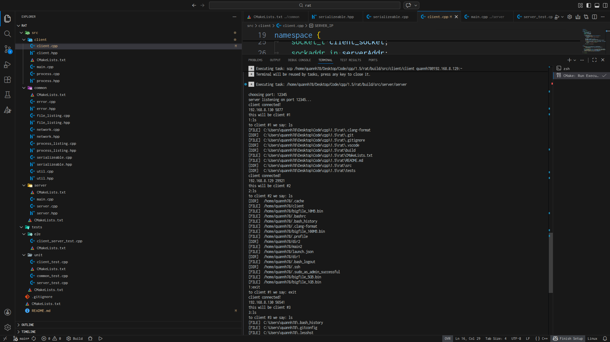
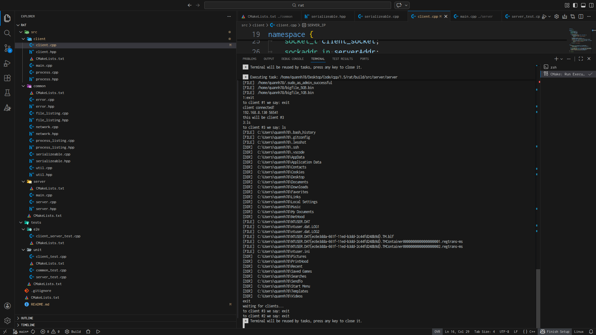
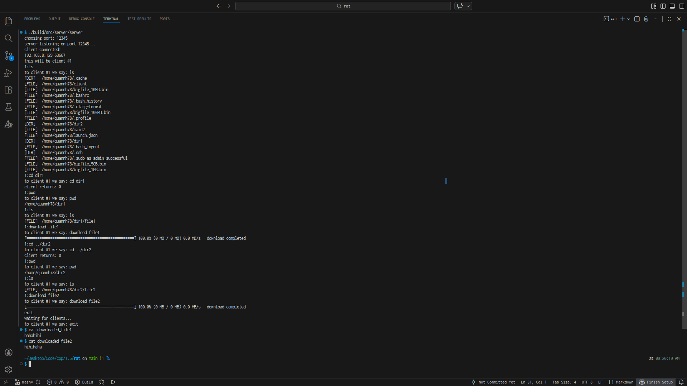
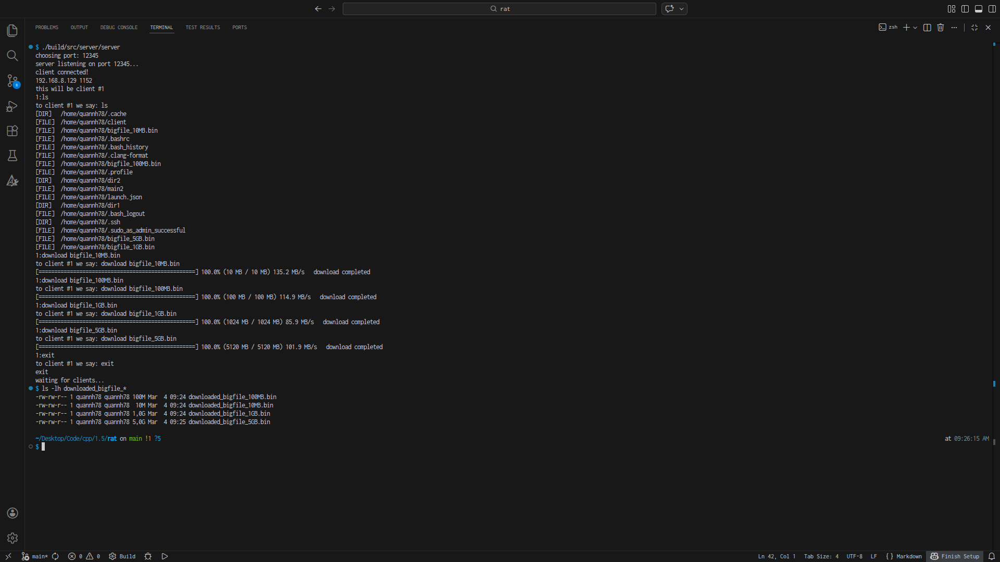
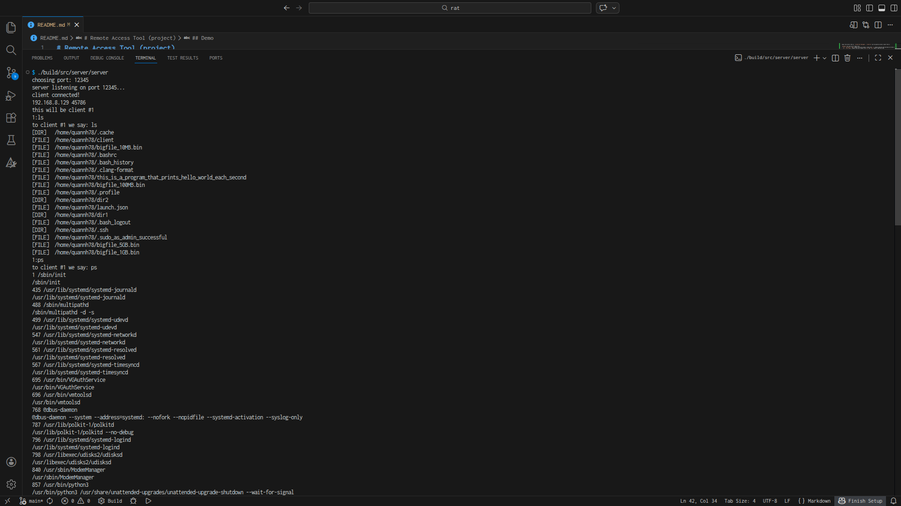
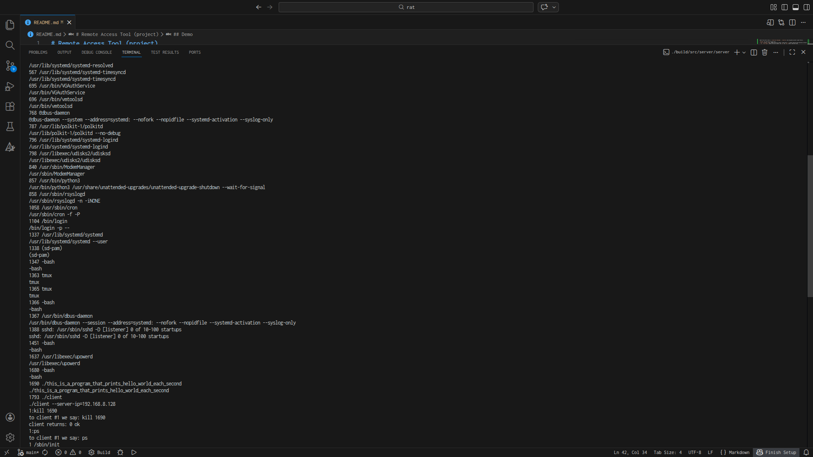
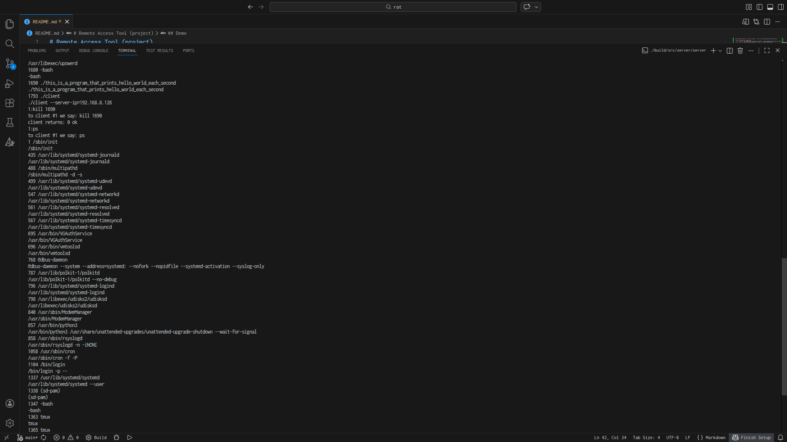
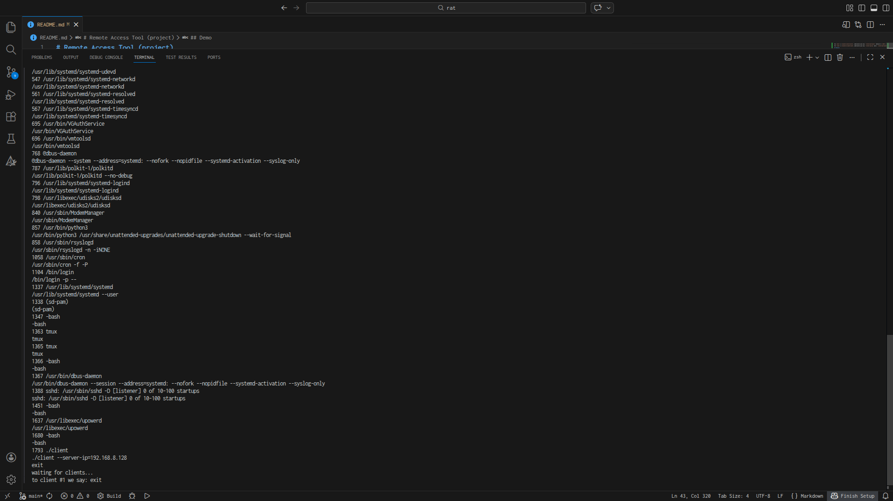

# Remote Access Tool (project)

This is a Remote Access Tool (RAT) project for learning purposes, obviously not for anything production related.

## Build and run

Install [CMake](https://cmake.org/download/) and run:

```bash
cmake -S . -B build/
cmake --build build/
```

Run `server` in `build/src/server/server`, additionally pass args `--server-port=<port>` (defaults to `12345`).

Run `client` in `build/src/client/client`, additionally pass args `--server-ip=<ip>` and/or `--server-port=<port>` (defaults to `127.0.0.1` and `12345`).

## Features

Input from server like so: `<client-id>:<message>`, `client-id` will be given by server (count from 1).

`message` will have one of these form:
- `ls`, `cd <dir>`, `pwd`: behave like you'd expect, except that `ls` outputs absolute path and does not take args (will fail if it's not exactly `ls`)
- `ps`, `kill <pid>`: behave like you'd expect, but `ps` and `kill` doesn't take more args
- `download <file>`: download `file` as `downloaded_file`, can download big file (> 4GB).
- `exit`: exit

Supports multiple clients (as evident by `<client-id>:<message>` input from server). Also support Windows (tested on Windows 11 x64).

There are also some tests, can be ran by `ctest --test-dir build` after building.

## Demo

Multiple clients and Windows: First we can see that client #1 connected, we say `1:ls` and see that it has Windows filesystem. Then client #2 connected, we do the same and it has a Linux filesystem. We disconnect the client #1, then client #3 connected with the same ip but in different directory in filesystem.



`ls`, `cd`, `pwd`, `download`: Client #1 connected and we saw that it has `~/dir1/` and `~/dir2/`. We cd into them and found out that they have `file1` and `file2`, respectively. We then download both file and check its content.


Download big file: Client #1 connected and we saw that it conveniently has `bigfile_10MB.bin`, `bigfile_100MB.bin`, `bigfile_1GB.bin`, `bigfile_5GB.bin` for we to test our `download`. We downloaded them and checked with `ls -lh` to see that it's really that big. (They were created with `dd if=/dev/random of=bigfile_X.bin bs=1M count=X`)


`ps` and `kill`: Client #1 connected, we executed `ps` and saw that it conveniently has `./this_is_a_program_that_prints_hello_world_each_second` for we to test our `kill`. We executed `kill` and `ps` again to see that it's really kiled. (It was `main2` in previous demo but was renamed to that for better demonstration purposes).




